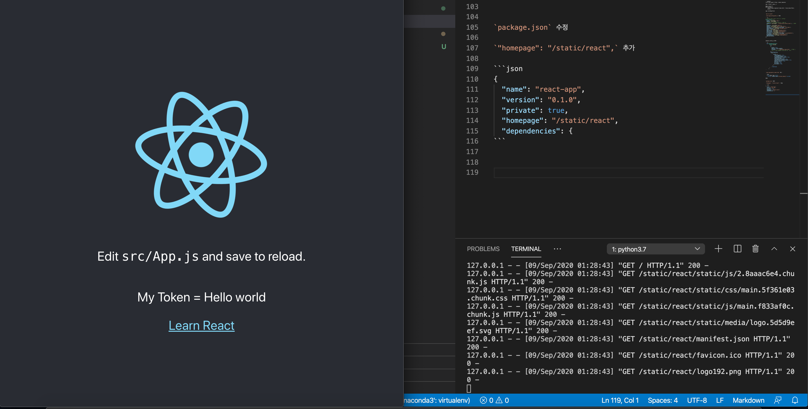

# React APP을 플라스크 서버 위에 호스팅하기.

* yarn build 한 index.html 파일을 그대로 flask 에서 리턴하게 했더니 안되어서 시작한 테스트.

```sh
yarn global add create-react-app react-scripts
create-react-app react-app
```

```
.
├── README.md  
├── README.md  
└── flask-server/  
    └──static/  
    └──templates/  
    └── main.py  
└── react-app/  
    └── node_modules/  
    └── public/  
    └── src/  
```

- main.py 내용

```python3
from flask import (Flask, render_template)

app = Flask("__main__")

@app.route("/")
def my_index():
    return render_template("index.html", flask_token="Hello   world")

app.run(debug=True)
```

`npm run eject`

`react-app/config/path.js` 수정

```js
// config after eject: we're in ./config/
module.exports = {
  dotenv: resolveApp('.env'),
  appPath: resolveApp('.'),
  //appBuild: resolveApp('build'), 수정 전
  appBuild: resolveApp('../flask-server/static/react'), // 수정 후
  appPublic: resolveApp('public'),
  appHtml: resolveApp('public/index.html'),
  appIndexJs: resolveModule(resolveApp, 'src/index'),
  appPackageJson: resolveApp('package.json'),
  appSrc: resolveApp('src'),
  appTsConfig: resolveApp('tsconfig.json'),
  appJsConfig: resolveApp('jsconfig.json'),
  yarnLockFile: resolveApp('yarn.lock'),
  testsSetup: resolveModule(resolveApp, 'src/setupTests'),
  proxySetup: resolveApp('src/setupProxy.js'),
  appNodeModules: resolveApp('node_modules'),
  publicUrlOrPath,
};
```


webpack.config.js 수정

```js
  new HtmlWebpackPlugin(
        Object.assign(
          {},
          {
            inject: true,
            template: paths.appHtml,
            filename: "../../templates/index.html",  //추가 된 라인 -> react app에게 어떤 path 인지 명시
          },
          isEnvProduction
            ? {
                minify: {
                  removeComments: true,
                  collapseWhitespace: true,
                  removeRedundantAttributes: true,
                  useShortDoctype: true,
                  removeEmptyAttributes: true,
                  removeStyleLinkTypeAttributes: true,
                  keepClosingSlash: true,
                  minifyJS: true,
                  minifyCSS: true,
                  minifyURLs: true,
                },
              }
            : undefined
        )
      ),
```


`react-app/public/index.html` 에서

```html
  <title>React App</title>
    <script> window.token="{{flask_token}}"</script>
```
수정


`package.json` 수정

`"homepage": "/static/react",` 추가

```json
{
  "name": "react-app",
  "version": "0.1.0",
  "private": true,
  "homepage": "/static/react",
  "dependencies": {
```


`python3 main.py`

그리구

`yarn build`

짜잔 !




## react build 된 앱 flask 에 올리시고 싶다면..

`git clone https://github.com/kimsehwan96/react-with-flask.git`

`cd react-with-flask`

`mkdir flask-server/static`

`mkdir flask-server/templates`

`cd react-app`

`npm install`

개발 시작~